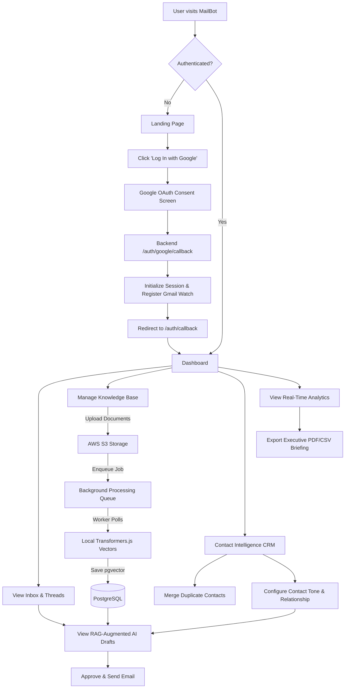
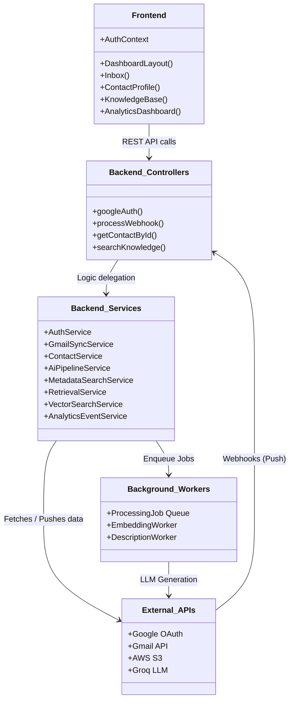
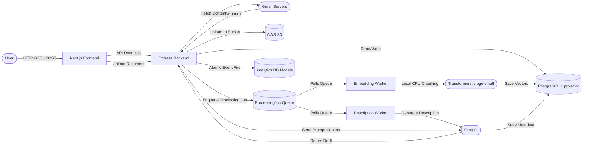
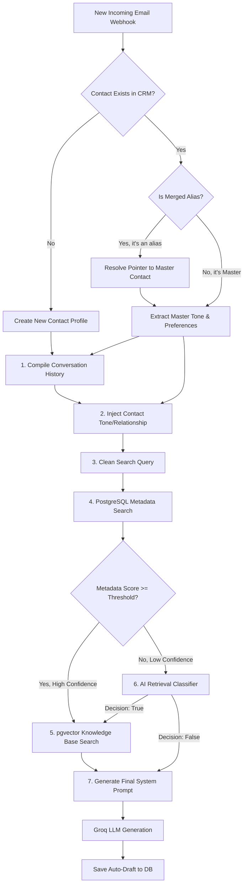
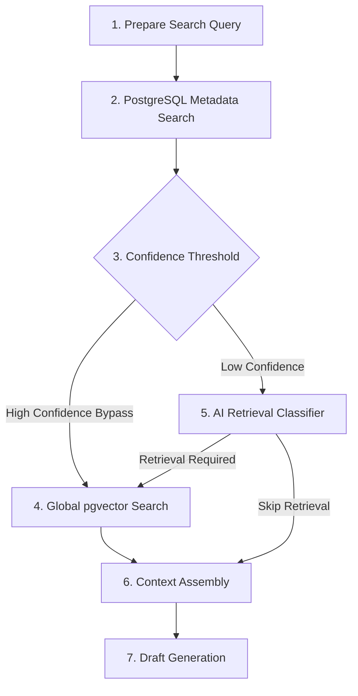

<div align="center">
  

  # MailBot
  
  **An AI-Powered Email Assistant**
  
  [](frontend/package.json)
  [](backend/package.json)
  [](#)
  [](#)

  <br />
  <i>Seamlessly integrating with Gmail to automate workflows, categorize communications, and draft intelligent responses in real-time.</i>
</div>

<br />

## Core Capabilities

<table>
  <tr>
    <td width="50%">
      <h3> Real-Time Synchronization</h3>
      <p>Direct integration with Google Cloud Pub/Sub webhooks ensures your inbox state is updated instantly the millisecond an email arrives.</p>
    </td>
    <td width="50%">
      <h3> AI-Assisted Drafting</h3>
      <p>Leverages lightning-fast LLMs (like Groq) to deeply analyze incoming threads and automatically propose context-aware, ready-to-send draft replies.</p>
    </td>
  </tr>
  <tr>
    <td width="50%">
      <h3> Intelligent Organization</h3>
      <p>Auto-categorizes emails, extracts rich metadata, and groups messages into unified, beautifully designed chronological threads.</p>
    </td>
    <td width="50%">
      <h3> Automated CRM</h3>
      <p>Passively builds a directory of contacts and organizations by extracting sender data and interaction history from every email.</p>
    </td>
  </tr>
  <tr>
    <td width="50%">
      <h3> Semantic Knowledge Base</h3>
      <p>Upload and manage documents with automatic AI chunking, parsing, and pgvector-based semantic search to build a personalized RAG pipeline.</p>
    </td>
    <td width="50%">
      <h3> RAG-Augmented Drafts</h3>
      <p>Injects exact context from your uploaded AWS S3 documents directly into the AI prompts, ensuring your drafts are factually accurate and personalized to your unique data.</p>
    </td>
  </tr>
  <tr>
    <td width="50%">
      <h3> Real-Time Analytics Dashboard</h3>
      <p>Atomic event tracking for email volume, draft efficiency, and AI confidence with live WebSocket updates and interactive charting.</p>
    </td>
    <td width="50%">
      <h3> Executive Briefing Exports</h3>
      <p>Native vector PDF and CSV generation engines that convert raw analytics data into perfectly aligned, human-readable executive narratives.</p>
    </td>
  </tr>
  <tr>
    <td width="50%">
      <h3> Hybrid Metadata Retrieval</h3>
      <ul>
        <li>Metadata-Assisted Retrieval Decision</li>
        <li>Hybrid Metadata Search (PostgreSQL Full-Text Search + pg_trgm)</li>
        <li>Confidence-Based Retrieval Bypass</li>
        <li>Fault-Tolerant Processing</li>
      </ul>
    </td>
    <td width="50%">
      <h3> Automated Document Processing</h3>
      <ul>
        <li>Automatic AI Document Description Generation</li>
        <li>Background Description Worker</li>
        <li>Intelligent Document Sampling</li>
      </ul>
    </td>
  </tr>
</table>

<br />

---

## Diagrams

### 1. User Experience & Application Flow


### 2. Class / Component Diagram


### 3. Data Flow Diagram (DFD)


### 4. AI Prompt Priority Pipeline


### 5. Knowledge Retrieval Architecture


---

## AI Knowledge Pipeline

The MailBot AI Knowledge Pipeline orchestrates the ingestion, enrichment, and retrieval of documents. It actively optimizes both speed and API cost by eliminating redundant AI processing.

1. **Upload Processing Pipeline:** 
   `Upload` → `Text Extraction` → `Chunking` → `Embedding` → `Store Chunks` → `Document Searchable` → `Queue DOCUMENT_DESCRIPTION` → `Description Worker` → `Representative Chunk Sampling` → `Groq Summary Generation` → `Save AI Description`.
   
2. **Hybrid Retrieval Pipeline:**
   `PrepareSearchQuery` → `Metadata Search` → `Confidence Threshold` → `High Confidence Bypass` → `AI Retrieval Classifier (fallback only)` → `Global pgvector Search` → `Context Assembly` → `Draft Generation`.

**How it works:** When an email arrives, MailBot performs a lightning-fast PostgreSQL Metadata Search (Full-Text Search + pg_trgm) against document titles and AI-generated descriptions. This metadata search is used **only** to decide whether retrieval is necessary. If metadata confidence is high, it entirely bypasses the expensive LLM classifier. If confidence is low, it falls back to the AI Retrieval Classifier. Semantic vector search via pgvector remains the sole mechanism for selecting actual document chunks.

---

## Comprehensive Folder & File Structure

```text
mailman/
├── backend/
│   ├── prisma/
│   │   ├── migrations/              # Database migration history
│   │   └── schema.prisma            # Main Prisma schema definition
│   ├── src/
│   │   ├── modules/
│   │   │   ├── ai/                  # AI drafting and pipeline services
│   │   │   ├── gmail/               # Gmail synchronization and webhooks
│   │   │   ├── jobs/                # Background Processing
│   │   │   │   ├── workers/
│   │   │   │   │   ├── description.worker.ts
│   │   │   │   │   └── embedding.worker.ts
│   │   │   └── knowledge/           # Knowledge Base: Parsing, Chunking, S3 Storage, pgvector Search, bge-small-en-v1.5 Embeddings
│   │   │       ├── knowledge.controller.ts
│   │   │       ├── knowledge.route.ts
│   │   │       └── services/
│   │   │           ├── metadata-search.service.ts
│   │   │           └── retrieval.service.ts
│   │   ├── routes/
│   │   │   └── v1/                  # Main router entrypoint
│   │   └── server.ts                # Starts the HTTP server and Prisma client
└── frontend/
    └── src/
        ├── app/
        │   ├── (dashboard)/         # Protected application layout group
        │   │   ├── analytics/page.tsx # Renders charts for email activity
        │   │   ├── drafts/page.tsx    # Renders pending AI drafts
        │   │   ├── inbox/page.tsx     # Renders the primary email feed
        │   │   ├── knowledge-base/page.tsx # Semantic AI Document Manager
        │   │   └── layout.tsx       # Sidebar and Topbar wrapper for the dashboard
        │   ├── auth/callback/
        │   │   └── page.tsx         # Rehydrates user state after Google OAuth redirect
        │   ├── error.tsx            # Next.js global error boundary
        │   ├── globals.css          # Tailwind base directives and CSS variables
        │   ├── layout.tsx           # The root Next.js document layout
        │   └── page.tsx             # The unauthenticated marketing/landing page
        ├── components/
        │   ├── auth/                # ProtectedRoute wrapper
        │   ├── dashboard/           # Specific dashboard widgets (Sidebar, Navbar)
        │   └── ui/                  # Reusable Radix/Tailwind components (Buttons, Modals)
        ├── lib/
        │   ├── api.ts               # Pre-configured Axios instance with credentials
        │   └── utils.ts             # Tailwind class merging (cn)
        └── providers/
            ├── AuthProvider.tsx     # React Context for global User state
            └── SocketProvider.tsx   # React Context for WebSocket connections
```

---

## Full Database Schema (Entity-Relationship)

```mermaid
erDiagram
    Contact ||--o| Contact : mergedInto

    User {
        String id PK
        String email UK
        String name
        String avatarUrl
        String timezone
        String locale
        DateTime createdAt
        DateTime updatedAt
        DateTime deletedAt
    }
    
    EmailAccountConnection {
        String id PK
        String userId FK
        EmailProvider provider
        String providerAccountId
        String emailAddress
        String encryptedAccessToken
        String encryptedRefreshToken
        DateTime accessTokenExpiresAt
        String scope
        String syncToken
        BigInt lastHistoryId
        DateTime lastSuccessfulSyncAt
        DateTime watchExpiration
        SyncStatus syncStatus
        String lastSyncError
        Boolean isActive
        DateTime createdAt
        DateTime updatedAt
        DateTime deletedAt
    }
    
    Organization {
        String id PK
        String userId FK
        String domain
        String name
        String industry
        String companyWebsite
        DateTime createdAt
        DateTime updatedAt
        DateTime deletedAt
    }
    
    Contact {
        String id PK
        String userId FK
        String organizationId FK
        String emailAddress
        String displayName
        String avatarUrl
        String jobTitle
        String phoneNumber
        String preferredTone
        ContactRelationship relationship
        Boolean favorite
        Boolean pinned
        ContactDirection lastContactedDirection
        String company
        String linkedinUrl
        String website
        String twitterUrl
        StringArray labels
        String aiSummary
        DateTime lastSummaryGeneratedAt
        String mergedIntoId FK "Points to master contact"
        Int interactionCount
        DateTime lastInteraction
        String customNotes
        DateTime createdAt
        DateTime updatedAt
        DateTime deletedAt
    }
    
    EmailThread {
        String id PK
        String userId FK
        String accountConnectionId FK
        String providerThreadId
        String subject
        Int messageCount
        DateTime lastMessageAt
        DateTime createdAt
        DateTime updatedAt
        DateTime deletedAt
    }
    
    Email {
        String id PK
        String userId FK
        String accountConnectionId FK
        String emailThreadId FK
        String providerMessageId
        String providerConversationId
        String internetMessageId
        String inReplyTo
        String[] referencesHeader
        String subject
        String plainBody
        String htmlBody
        String snippet
        DateTime providerInternalDate
        DateTime receivedAt
        DateTime sentAt
        Boolean isRead
        Boolean isStarred
        Boolean isImportant
        Boolean isDraft
        Boolean isDeleted
        Boolean isArchived
        Boolean isSpam
        EmailCategory category
        Priority priority
        Boolean needsReply
        ReplyStatus replyStatus
        String summary
        Sentiment sentiment
        Intent intent
        Float confidence
        ProcessingStatus processingStatus
        Boolean hasAttachments
        BigInt providerHistoryId
        Json metadata
        DateTime createdAt
        DateTime updatedAt
        DateTime deletedAt
    }
    
    EmailLabel {
        String id PK
        String emailId FK
        String providerLabelId
        String name
        EmailLabelType type
        String color
        DateTime createdAt
    }
    
    EmailParticipant {
        String id PK
        String emailId FK
        String contactId FK
        String emailAddress
        String displayName
        ParticipantRole role
    }
    
    Attachment {
        String id PK
        String emailId FK
        String filename
        String mimeType
        AttachmentCategory mimeCategory
        Int sizeBytes
        String storagePath
        StorageProvider storageProvider
        String checksum
        ProcessingStatus processingStatus
        DateTime createdAt
        DateTime updatedAt
        DateTime deletedAt
    }
    
    AiDraftReply {
        String id PK
        String emailId FK
        String userId FK
        String generatedText
        AiProvider provider
        String modelName
        String promptVersion
        Float temperature
        Int promptTokens
        Int completionTokens
        Int totalTokens
        Int generationLatencyMs
        Decimal cost
        Float confidence
        ApprovalStatus approvalStatus
        String editedText
        Boolean isFinal
        Json reasoningMetadata
        DateTime createdAt
        DateTime updatedAt
        DateTime deletedAt
    }
    
    SentReply {
        String id PK
        String originalEmailId FK
        String draftId FK
        String sentEmailId
        String providerMessageId
        DeliveryStatus deliveryStatus
        String failureReason
        DateTime sentAt
    }
    
    KnowledgeBaseDocument {
        String id PK
        String userId FK
        String title
        String description
        String fileType
        String mimeType
        Int fileSize
        String checksum
        String storagePath
        StorageProvider storageProvider
        KnowledgeSource source
        ProcessingStatus processingStatus
        Int version
        Boolean isEmbedded
        DateTime embeddedAt
        DateTime createdAt
        DateTime updatedAt
        DateTime deletedAt
        String originalFileName
        String folder
        Boolean isArchived
        Int chunkCount
        Int retrievalCount
        DateTime lastRetrievedAt
        DateTime lastAccessedAt
        String processingError
        DateTime processedAt
        String fileHash
        String storageKey
    }
    
    KnowledgeBaseChunk {
        String id PK
        String documentId FK
        Int chunkIndex
        String content
        Int tokenCount
        String embeddingModel
        Unsupported embedding
        Json metadata
        DateTime deletedAt
        Int pageNumber
        String heading
        String section
        Int sourceOffsetStart
        Int sourceOffsetEnd
        Int documentVersion
    }
    
    PromptTemplate {
        String id PK
        String userId FK
        String name
        String description
        PromptType type
        String content
        Int version
        Boolean isActive
        DateTime createdAt
        DateTime updatedAt
        DateTime deletedAt
    }
    
    UserSetting {
        String id PK
        String userId FK
        Boolean autoReply
        String businessHoursStart
        String businessHoursEnd
        String businessHoursTimezone
        String replySignature
        AiProvider preferredAiProvider
        String preferredAiModel
        String theme
        Boolean notifyOnNewEmail
        Boolean notifyOnDraftReady
        Boolean notifyOnErrors
        Float confidenceThreshold
        DraftApprovalMode draftApprovalMode
        Json dynamicConfig
        DateTime createdAt
        DateTime updatedAt
    }
    
    Notification {
        String id PK
        String userId FK
        NotificationType type
        String title
        String message
        Boolean isRead
        String linkUrl
        DateTime createdAt
        DateTime updatedAt
        DateTime deletedAt
    }
    
    ProcessingJob {
        String id PK
        String userId FK
        JobType jobType
        ProcessingEntityType entityType
        String entityId
        ProcessingStatus status
        Int priority
        Int attempts
        Int maxAttempts
        String errorLog
        String workerId
        DateTime nextRetryAt
        DateTime startedAt
        DateTime completedAt
        DateTime createdAt
        DateTime updatedAt
    }
    
    Analytics {
        String id PK
        String userId FK
        DateTime date
        Int emailsReceived
        Int emailsClassified
        Int emailsSummarized
        Int emailsReplied
        Int draftsGenerated
        Int draftsApproved
        Int draftsRejected
        Float averageConfidence
        Float averageLatency
        Float averageReplyGenerationTime
        Int totalPromptTokens
        Int totalCompletionTokens
        Decimal estimatedCost
        Int timeSavedSeconds
        Int knowledgeRetrievalCount
        Int documentsUploaded
        Int documentsEmbedded
        Int processingFailures
        BigInt storageUsedBytes
        Int contactsCreated
        Int organizationsCreated
        DateTime createdAt
        DateTime updatedAt
    }
    
    ActivityLog {
        String id PK
        String userId FK
        ActivityType action
        String entityType
        String entityId
        Severity severity
        String ipAddress
        String userAgent
        Json metadata
        DateTime createdAt
    }
    
    ApiKey {
        String id PK
        String userId FK
        String keyHash
        String name
        Boolean isActive
        DateTime expiresAt
        DateTime lastUsedAt
        DateTime lastRotatedAt
        DateTime createdAt
        DateTime updatedAt
        DateTime deletedAt
    }

    User ||--o| UserSetting : has
    User ||--o{ EmailAccountConnection : has
    User ||--o{ EmailThread : has
    User ||--o{ Email : has
    User ||--o{ Contact : has
    User ||--o{ Organization : has
    User ||--o{ AiDraftReply : has
    User ||--o{ KnowledgeBaseDocument : has
    User ||--o{ PromptTemplate : has
    User ||--o{ Notification : has
    User ||--o{ ProcessingJob : has
    User ||--o{ Analytics : has
    User ||--o{ ActivityLog : has
    User ||--o{ ApiKey : has

    EmailAccountConnection ||--o{ EmailThread : contains
    EmailAccountConnection ||--o{ Email : contains

    Organization ||--o{ Contact : has

    Contact ||--o{ EmailParticipant : is

    EmailThread ||--o{ Email : contains

    Email ||--o{ EmailParticipant : has
    Email ||--o{ Attachment : has
    Email ||--o{ EmailLabel : has
    Email ||--o{ AiDraftReply : has
    Email ||--o{ SentReply : has

    AiDraftReply ||--o| SentReply : generates
    
    KnowledgeBaseDocument ||--o{ KnowledgeBaseChunk : contains
```



---

## How to Run Locally

### Prerequisites
1. Node.js (v18+)
2. PostgreSQL (or Supabase Connection Pool)
3. Google Cloud Console credentials for OAuth and Webhook Pub/Sub
4. Groq API Key (or other LLM API keys)

### Backend Setup
1. Navigate to the backend directory:
   ```bash
   cd backend
   ```
2. Install dependencies:
   ```bash
   npm install
   ```
3. Set up your `.env` file (Database URL, Google OAuth IDs, Session Secrets).
4. Run migrations and generate Prisma client:
   ```bash
   npx prisma migrate dev
   npx prisma generate
   ```
5. Start the backend:
   ```bash
   npm run dev
   ```

### Frontend Setup
1. Navigate to the frontend directory:
   ```bash
   cd frontend
   ```
2. Install dependencies:
   ```bash
   npm install
   ```
3. Ensure you have the `NEXT_PUBLIC_API_URL` environment variable set if testing against a deployed backend.
4. Start the frontend:
   ```bash
   npm run dev
   ```

---

## Improvements Still Needed

- **OCR for Image Chunking:** Add Optical Character Recognition so images uploaded to the knowledge base can have text extracted and chunked for RAG.
- **Security Handlers:** Implement robust security handling for production APIs and webhooks.
- **Logging System:** Remove `morgan` and implement a production-grade logging system.
