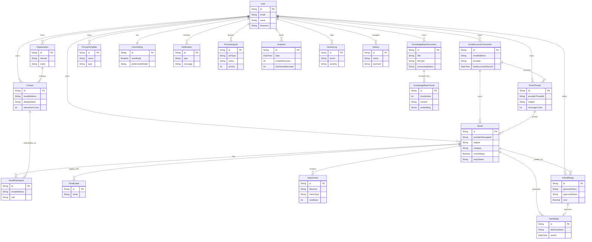

# MailBot

MailBot is a production-quality, AI-powered email management platform.

## Current Status

**Backend Version 0.2.0 (Phase 2 Completed)**
The project is currently configured as a modular monolith. The frontend and backend are completely decoupled into distinct projects, each with their own versioning (`backend/package.json` vs `frontend/package.json`), allowing for a clean separation of concerns.

## Database Architecture

MailBot uses a comprehensive PostgreSQL schema orchestrated via Prisma, featuring AI embedding capabilities via `pgvector`.

## AI Integration Strategy

*   **MailBot Version 1 uses Groq as its default inference provider.**
*   The database schema remains completely **provider-agnostic** to support future integrations.
*   Future versions can seamlessly switch between providers (OpenAI, Anthropic, Gemini, Custom) without requiring any schema redesign or migrations.



## Tech Stack

**Frontend:**
- Next.js 15 (App Router)
- TypeScript
- Tailwind CSS
- React Query, React Hook Form, Zod
- Shadcn UI, Lucide React

**Backend:**
- Node.js & Express
- TypeScript
- Prisma ORM
- PostgreSQL (Supabase)
- Pino (Logging), Socket.IO (WebSockets)

## Folder Structure

```text
mailbot/
├── backend/
├── frontend/
├── CHANGELOG.md
├── LICENSE
└── README.md
```

## Installation Instructions

1. **Clone the repository**
2. **Setup Frontend:**
   ```bash
   cd frontend
   npm install
   ```
3. **Setup Backend:**
   ```bash
   cd backend
   npm install
   cp .env.example .env
   npx prisma generate
   ```

## Development Commands

- **Start Frontend:** `cd frontend && npm run dev`
- **Start Backend:** `cd backend && npm run dev`

## Future Roadmap
- Phase 1: Authentication & Core Architecture (Current)
- Phase 2: Email Provider Integrations (Gmail/Outlook)
- Phase 3: AI Categorization & Parsing
- Phase 4: Migration to Microservices (Event-Driven Architecture)

## License
This project is licensed under the MIT License - see the LICENSE file for details.
