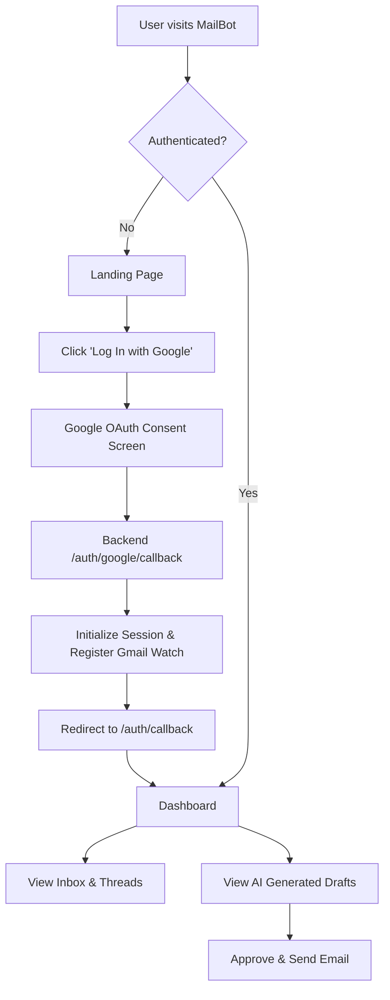
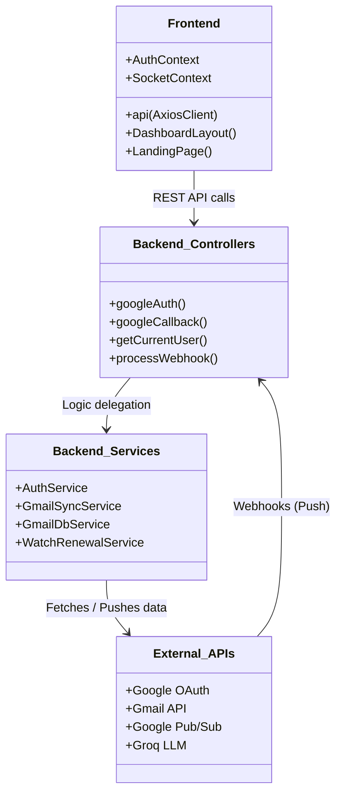
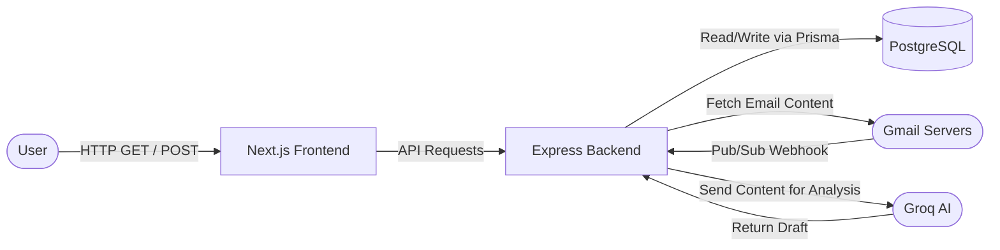
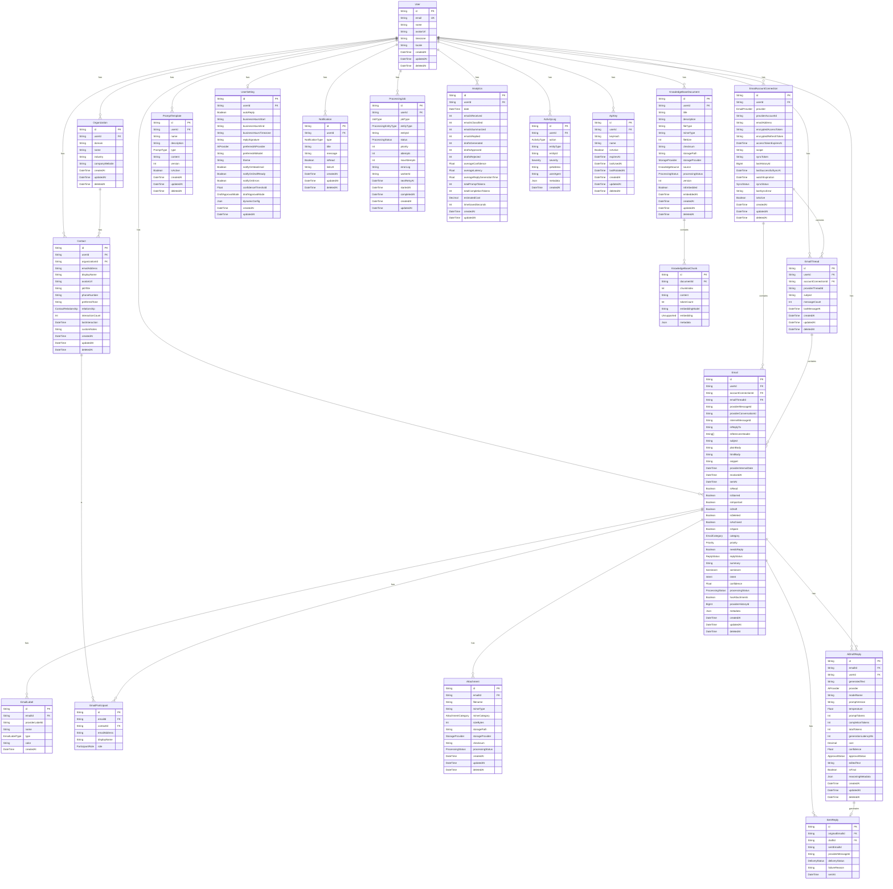

<div align="center">
  

  # MailBot
  
  **The Next-Generation AI-Powered Email Intelligence Platform**
  
  [](frontend/package.json)
  [](backend/package.json)
  [](#)
  [](#)

  <br />
  <i>Seamlessly integrating with Gmail to automate workflows, categorize communications, and draft intelligent responses in real-time.</i>
</div>

<br />

## Core Capabilities

<table>
  <tr>
    <td width="50%">
      <h3> Real-Time Synchronization</h3>
      <p>Direct integration with Google Cloud Pub/Sub webhooks ensures your inbox state is updated instantly the millisecond an email arrives.</p>
    </td>
    <td width="50%">
      <h3> AI-Assisted Drafting</h3>
      <p>Leverages lightning-fast LLMs (like Groq) to deeply analyze incoming threads and automatically propose context-aware, ready-to-send draft replies.</p>
    </td>
  </tr>
  <tr>
    <td width="50%">
      <h3> Intelligent Organization</h3>
      <p>Auto-categorizes emails, extracts rich metadata, and groups messages into unified, beautifully designed chronological threads.</p>
    </td>
    <td width="50%">
      <h3> Automated CRM</h3>
      <p>Passively builds a directory of contacts and organizations by extracting sender data and interaction history from every email.</p>
    </td>
  </tr>
</table>

<br />

---

## Diagrams

### 1. User Experience & Application Flow


### 2. Class / Component Diagram


### 3. Data Flow Diagram (DFD)


---

## Comprehensive Folder & File Structure

```text
mailman/
├── backend/
│   ├── prisma/
│   │   ├── migrations/              # Database migration history
│   │   └── schema.prisma            # Main Prisma schema definition
│       │           └── watch-renewal.service.ts # Renews the Gmail Pub/Sub watch expiration
│       ├── routes/
│       │   ├── v1/
│       │   │   ├── auth.route.ts    # Routes for /api/v1/auth
│       │   │   ├── health.route.ts  # Standard uptime check
│       │   │   └── index.ts         # Main router entrypoint
│       └── app.ts                   # Express app configuration (CORS, Morgan, helmet)
│       └── server.ts                # Starts the HTTP server and Prisma client
└── frontend/
    └── src/
        ├── app/
        │   ├── (dashboard)/         # Protected application layout group
        │   │   ├── analytics/page.tsx # Renders charts for email activity
        │   │   ├── drafts/page.tsx    # Renders pending AI drafts
        │   │   ├── inbox/page.tsx     # Renders the primary email feed
        │   │   └── layout.tsx       # Sidebar and Topbar wrapper for the dashboard
        │   ├── auth/callback/
        │   │   └── page.tsx         # Rehydrates user state after Google OAuth redirect
        │   ├── error.tsx            # Next.js global error boundary
        │   ├── globals.css          # Tailwind base directives and CSS variables
        │   ├── layout.tsx           # The root Next.js document layout
        │   └── page.tsx             # The unauthenticated marketing/landing page
        ├── components/
        │   ├── auth/                # ProtectedRoute wrapper
        │   ├── dashboard/           # Specific dashboard widgets (Sidebar, Navbar)
        │   └── ui/                  # Reusable Radix/Tailwind components (Buttons, Modals)
        ├── lib/
        │   ├── api.ts               # Pre-configured Axios instance with credentials
        │   └── utils.ts             # Tailwind class merging (cn)
        └── providers/
            ├── AuthProvider.tsx     # React Context for global User state
            └── SocketProvider.tsx   # React Context for WebSocket connections
```

---

## Full Database Schema (Entity-Relationship)



---

## How to Run Locally

### Prerequisites
1. Node.js (v18+)
2. PostgreSQL (or Supabase Connection Pool)
3. Google Cloud Console credentials for OAuth and Webhook Pub/Sub
4. Groq API Key (or other LLM API keys)

### Backend Setup
1. Navigate to the backend directory:
   ```bash
   cd backend
   ```
2. Install dependencies:
   ```bash
   npm install
   ```
3. Set up your `.env` file (Database URL, Google OAuth IDs, Session Secrets).
4. Run migrations and generate Prisma client:
   ```bash
   npx prisma migrate dev
   npx prisma generate
   ```
5. Start the backend:
   ```bash
   npm run dev
   ```

### Frontend Setup
1. Navigate to the frontend directory:
   ```bash
   cd frontend
   ```
2. Install dependencies:
   ```bash
   npm install
   ```
3. Ensure you have the `NEXT_PUBLIC_API_URL` environment variable set if testing against a deployed backend.
4. Start the frontend:
   ```bash
   npm run dev
   ```
